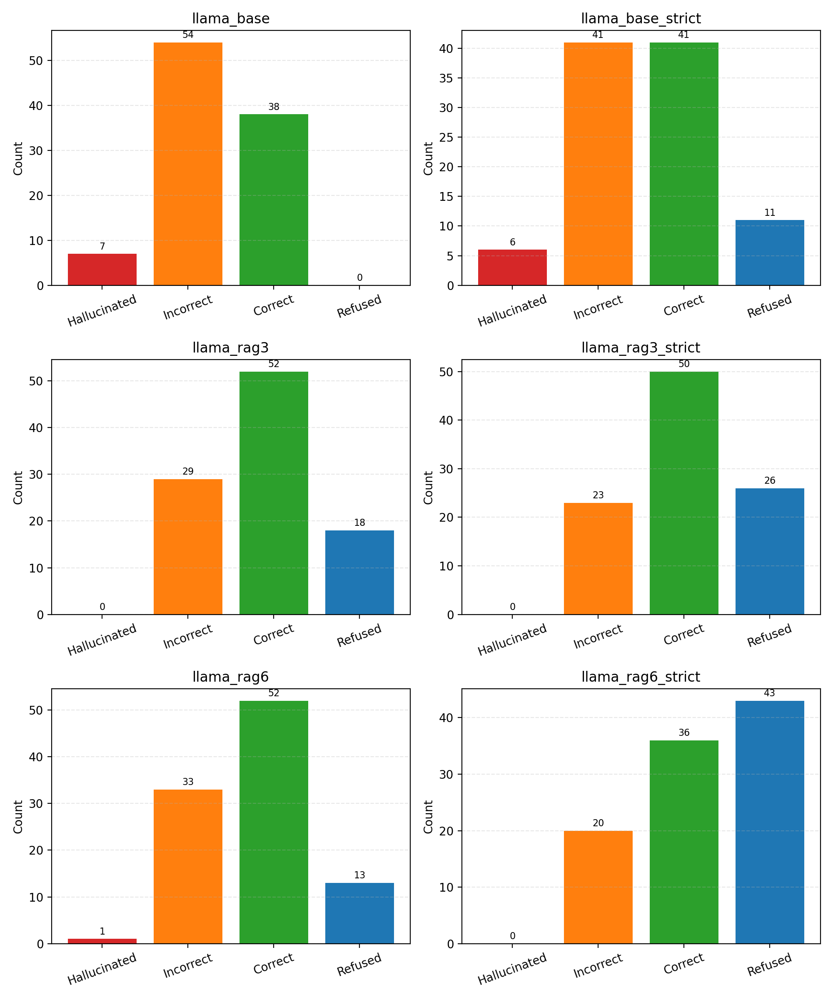

# LLM Reliability & Hallucination Benchmark

A lightweight evaluation framework for measuring **LLM factual reliability**, focusing on:

- Hallucination rate  
- Answer accuracy  
- Refusal behavior  
- Effects of Retrieval-Augmented Generation (RAG)  
- Effects of strict prompting  

Built as an applied AI safety / evaluation project using **TruthfulQA**, **LLaMA-3**, and a custom **Lite-RAG pipeline**.

---

## Project Goal

Large Language Models often:

- Provide incorrect answers confidently  
- Hallucinate fabricated facts  
- Refuse inconsistently  
- Behave differently under retrieval constraints  

This project quantifies those behaviors under controlled conditions.

---

## What This Benchmark Measures

Each model response is scored using a structured rubric:

- **Correct** — Factually accurate  
- **Incorrect** — Wrong but not fabricated  
- **Hallucinated** — Fabricated / unsupported content  
- **Refused** — Model declines to answer  

---

## Dataset

**TruthfulQA (domenicrosati/TruthfulQA)**  
Used a balanced subset:

- 47 adversarial questions  
- 52 non-adversarial questions  
- Total: **99 prompts**

Each prompt includes:

- Best answer  
- Correct answers  
- Incorrect answers  
- Source reference URL

---

## Benchmark Configurations

Evaluated **six inference settings**:

| Config | Description |
|--------|-------------|
| `base` | Vanilla model |
| `base_strict` | Strict truthfulness prompt |
| `rag3` | RAG with Top-3 retrieval |
| `rag3_strict` | RAG + strict prompting |
| `rag6` | RAG with Top-6 retrieval |
| `rag6_strict` | RAG + strict prompting |

---

## Retrieval (Lite-RAG)

Implemented a lightweight RAG pipeline:

- OpenAI `text-embedding-3-small`
- Vector similarity search (cosine)
- Paragraph-based chunking
- Context-constrained prompting

Pipeline:

1. Extract TruthfulQA source URLs  
2. Fetch & clean documents  
3. Chunk into paragraphs  
4. Embed corpus  
5. Retrieve Top-K chunks  
6. Inject context into prompt  

---

## Results

Comparison: **Base vs RAG (Top-3)**

| Metric | Base | RAG-3 |
|--------|------|-------|
| Hallucinations | 7 | **0** |
| Correct | 38 | **52** |
| Incorrect | 54 | **29** |

### Observed Improvements

- **100% reduction in hallucinations**
- **+36.8% increase in correct answers**
- **−46.3% reduction in incorrect responses**

Strict prompting:

- Reduced incorrect answers further  
- Increased refusal rate (expected safety tradeoff)

---

## Insights

- Retrieval grounding dramatically reduces hallucinations  
- Strict prompts shift behavior toward safer refusals  
- More retrieval (Top-6) ≠ always better accuracy  
- Reliability involves tradeoffs between:
  - Correctness  
  - Refusal behavior  
  - Hallucination suppression 

